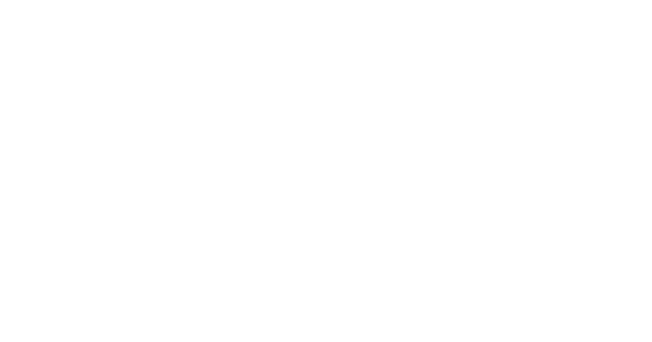
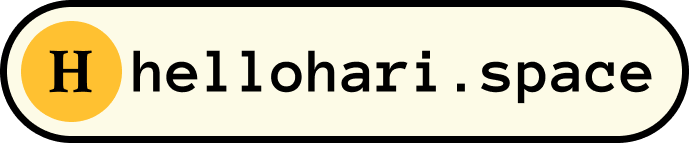

  
  

    
  

  <h1 style="text-align:center; color:#58a6ff;">💫 About Me</h1>
  

    👋 Hey there! I LIKE TERMINAL. 
    💻 I speak C++, Python, JavaScript (React/Node.js), and some Flutter. 
    ☁️ Moving on from the VibeCode era.  
    <> I like google tools incl. Gemini, GCP, Firebase, Flutter.  
    ☁️ Experminented with some ML projects 
    🎨 UI/UX nerd 
    🖥️ Linux (i use Arch btw 🐧). 
    learning to write scripts. 
    📂 Projects, experiments, and random code snippets live here. Enjoy exploring!
  

  

    
  

